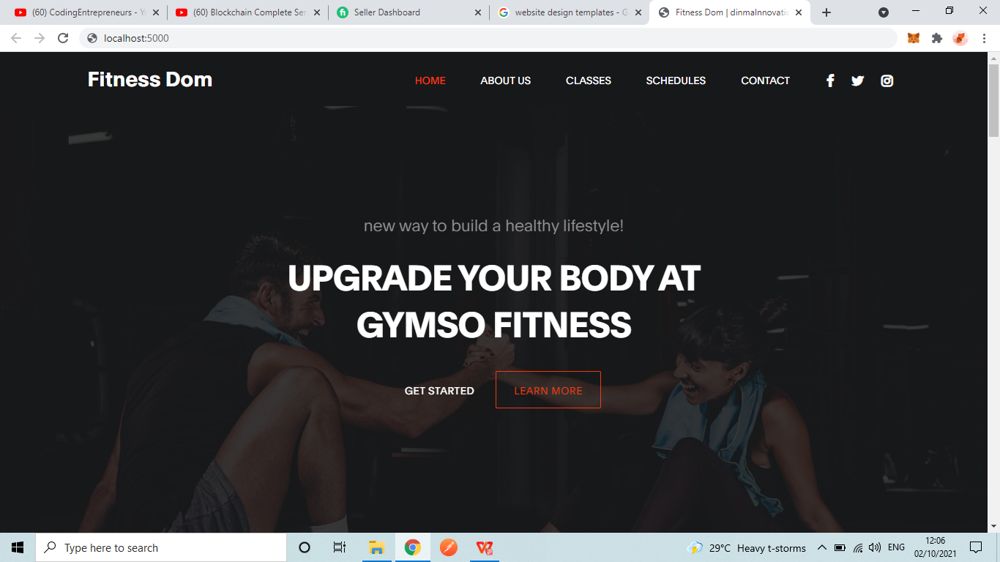
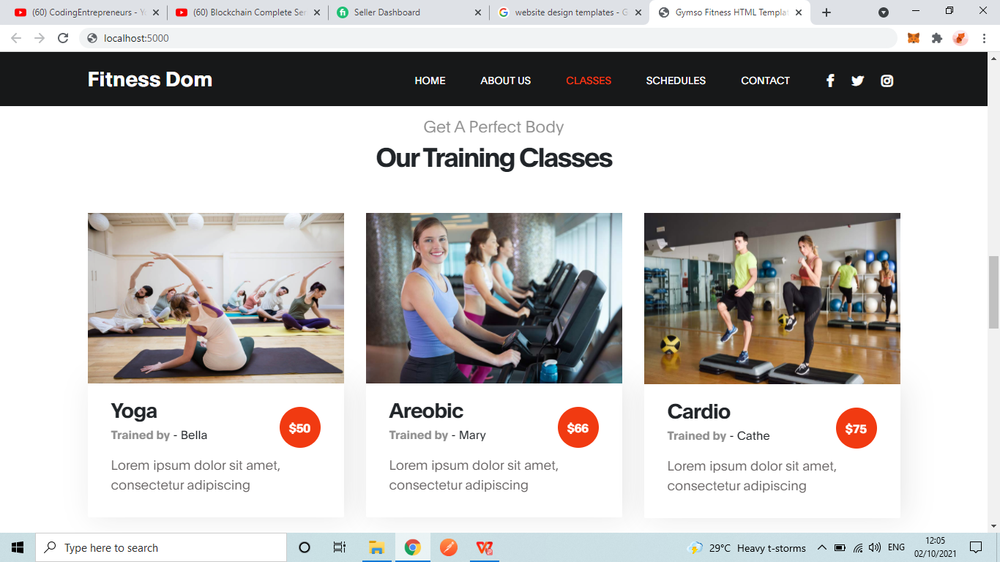

# README file for GYMSO-FITNESS React application

This project was bootstrapped with [Create React App](https://github.com/facebook/create-react-app).

## Table of Contents

-   [Overview](#overview)
    -   [About the Project](#about)
    -   [Screenshot of Project](#screenshot)
-   [My Process](#my-process)
    -   [Built with...](#built-with)
    -   [What I learned](#what-i-learned)
-   [Author](#author)
-   [Acknowledgments](#acknowledgments)
-   [Running this application](#npm-run)

## Overview

### About the Project

How to live a healthy life and developing a healthy body should not be difficult. Gymso fitness emphasizes on getting right information and best practices so as to achieve this.
To reach those who need the services this landing page was made.
🤦 was the intro nice?
This is a React application where styled-components is used to make trying out certain modern SASS practices

### Screenshot of Project




## My Process

### Built with...

-   React JS
-   Styled-components
-   JS [EcmaScript 6 practices]
-   SASS

### What I learned

Uhhm...
So basically, frontend development is more than just writing HTML, CSS code. For every line written, the whole structure of the application (UI) should be considered so that the layout does not break for varying screen sizes

Check out these lines 👀

```jsx
{./src/App.js}
<Navbar
    title="Gymso Fitness"
    inPageLinkList={[
        { name: "Home", link:"home-section"},
        {name: "About us", link: "about-us-section"},
        {name: "Classes", link: "classes-section"},
        {name: "Schedules", link: "schedules-section"},
        {name: "Contact", link: "contact-section"},
    ]}
>
```

```js
export default createGlobalStyle`
    * {
        margin: 0;
        padding: 0;
        --three-px: 3px;
        --seven-px: 7px;
        --ten-px: 10px;
        --gray:  #efefef9a;
    }
```

## Author

Website

> Twitter - [@ceoCodes](https://www.twitter.com/ceoCodes)
> Website - [My portfolio site](https://www.my-portfolio-site-is-not-ready.com)

# Running this application

## Available Scripts

In the project directory, you can run:

### `npm start`

Runs the app in the development mode.<br />
Open [http://localhost:3000](http://localhost:3000) to view it in the browser.

The page will reload if you make edits.<br />
You will also see any lint errors in the console.

### `npm test`

Launches the test runner in the interactive watch mode.<br />
See the section about [running tests](https://facebook.github.io/create-react-app/docs/running-tests) for more information.

### `npm run build`

Builds the app for production to the `build` folder.<br />
It correctly bundles React in production mode and optimizes the build for the best performance.

The build is minified and the filenames include the hashes.<br />
Your app is ready to be deployed!

See the section about [deployment](https://facebook.github.io/create-react-app/docs/deployment) for more information.

### `npm run eject`

**Note: this is a one-way operation. Once you `eject`, you can’t go back!**

If you aren’t satisfied with the build tool and configuration choices, you can `eject` at any time. This command will remove the single build dependency from your project.

Instead, it will copy all the configuration files and the transitive dependencies (webpack, Babel, ESLint, etc) right into your project so you have full control over them. All of the commands except `eject` will still work, but they will point to the copied scripts so you can tweak them. At this point you’re on your own.

You don’t have to ever use `eject`. The curated feature set is suitable for small and middle deployments, and you shouldn’t feel obligated to use this feature. However we understand that this tool wouldn’t be useful if you couldn’t customize it when you are ready for it.

## Learn More

You can learn more in the [Create React App documentation](https://facebook.github.io/create-react-app/docs/getting-started).

To learn React, check out the [React documentation](https://reactjs.org/).

### Code Splitting

This section has moved here: https://facebook.github.io/create-react-app/docs/code-splitting

### Analyzing the Bundle Size

This section has moved here: https://facebook.github.io/create-react-app/docs/analyzing-the-bundle-size

### Making a Progressive Web App

This section has moved here: https://facebook.github.io/create-react-app/docs/making-a-progressive-web-app

### Advanced Configuration

This section has moved here: https://facebook.github.io/create-react-app/docs/advanced-configuration

### Deployment

This section has moved here: https://facebook.github.io/create-react-app/docs/deployment

### `npm run build` fails to minify

This section has moved here: https://facebook.github.io/create-react-app/docs/troubleshooting#npm-run-build-fails-to-minify
